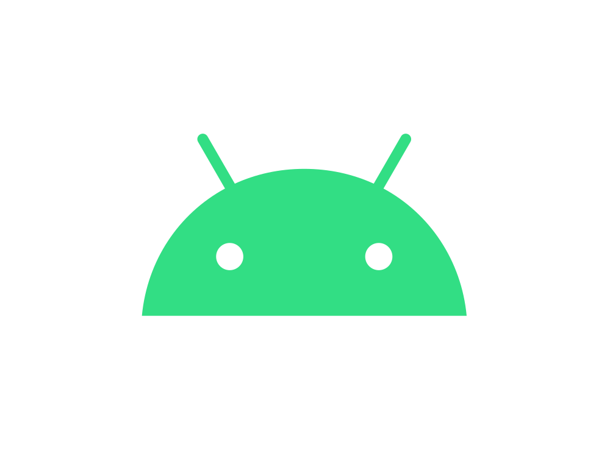

### About Me

[](https://www.linkedin.com/in/leonardo-tosin-b57406112/)
[](https://hits.seeyoufarm.com)

- 🔭  .NET and Dynamics AX developer by day, native Android developer by night and in the free time;
- 💻  Interested on Distributed Systems, Rest API, Artificial intelligence, Software Architecture and Big Data;
- 🎓  Next year(2022) i get my bachelor degree on Computer Science;
- 👯  I’m looking to collaborate on open source projects;
- ☕  Addicted to coffee;
- ⭐  Nerd, Otaku and Geek;

## Where find me
<a href='https://play.google.com/store/apps/dev?id=5200472266334008653&pcampaignid=pcampaignidMKT-Other-global-all-co-prtnr-py-PartBadge-Mar2515-1'></a>


#### History of my carrer
```diff
- Scientist/Researcher
- Full-Stack Software Developer
+ Computer Science student.
+ .NET and Dynamics AX Software Developer
+ Android Developer
```

## STACK

<p align="left">
  
  
  
  
  
  
  
  
  
  
  ## STATS
  
  <center>
  
<table>
  <tr>
      <td></td>
      <td></td>
  </tr>  
</table>
</center>
